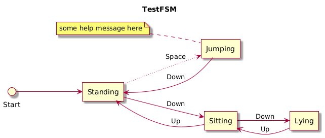

<a href="./README.md"></a>
<a href="./README.ru.md"></a>
<p align="center">
    <picture>
        <source media="(prefers-color-scheme: dark)" srcset="Media/logo-fsm-dark.png">
        <source media="(prefers-color-scheme: light)" srcset="Media/logo-fsm.png">
        
    </picture>
</p>
<h3 align="center">FSM для Shardy</h3>
<h4 align="center">Фреймворк для онлайн игр и приложений</h4>
<p align="center">
    <a href="#быстрый-старт">Быстрый старт</a> · <a href="./Documentation~/index.md">Документация</a> · <a href="https://github.com/mopsicus/shardy-unity">Unity клиент</a> · <a href="https://github.com/mopsicus/shardy">Shardy</a> · <a href="https://github.com/mopsicus/shardy-fsm/issues">Отчёт об ошибке</a>
</p>

# 💬 Описание

Этот пакет представляет собой реализацию конечного автомата (FSM) для Shardy и не только. Он предоставляет гибкий API для построения FSM с помощью цепочки методов и условий.

> [!NOTE] 
> Shardy – это фреймворк для онлайн игр и приложений на Node.js. Он предоставляет базовую функциональность для построения микросервисных решений: мобильных, социальных, веб, многопользовательских игр, приложений реального времени, чатов, middleware сервисов и т.п.
>
> [Узнать про Shardy](https://github.com/mopsicus/shardy) 💪

# ✨ Возможности

- Гибкий API: состояния, триггеры, условия
- Поддержка пользовательских типов состояний и триггеров
- Генерация UML-диаграмм (поддержка заметок)
- Справочные материалы: документация, сниппеты, примеры
- Не используются сторонние библиотеки

# 🚀 Использование

### Установка

Скачайте пакет со страницы [релизов](https://github.com/mopsicus/shardy-fsm/releases) или добавьте строчку ниже в ваш файл `Packages/manifest.json` и пакет будет установлен по адресу Git репозитория:

```
"com.mopsicus.shardy.fsm": "https://github.com/mopsicus/shardy-fsm.git",
```

### Настройка окружения

Настройте своё окружение для локальной разработки для удобства и "синхронизации" с текущим проектом. Так как Shardy и все остальные модули разрабатываются с использованием редактора VS Code, то все настройки и рекомендации предложены для него.

1. Используйте `Monokai Pro` или `eppz!` тему
2. Используйте `FiraCode` шрифт
3. Установите расширения:
   - C#
   - C# Dev Kit
   - Unity
4. Включите `Inlay Hints` в настройках C# расширения
5. Установить пакет `Visual Studio Editor` в редакторе Unity
6. Поместите файл `.editorconfig` в корневую папку проекта
7. Ура!

### Быстрый старт

1. Установите пакет
2. Добавьте `Shardy.FSM` в раздел uses
3. Определите состояния и триггеры
4. Вызовите метод `Builder`.
5. Добавьте состояния, триггеры, условия
6. Вызовите метод `Build` для завершения инициализации
7. Вызовите триггер(ы)
8. Профит

```csharp
using Shardy.FSM;

/// <summary>
/// Test FSM
/// </summary>
void Test() {
    _fsm = FSM<State, Action>.Builder(State.Standing)
    .State(State.Standing)
    .OnEnter((data) => {
        Debug.Log("on enter standing");
    })
    .To(State.Sitting).On(Action.Down)
    .To(State.Jumping).On(Action.Space).If(s => _isConditionActive)
    .State(State.Sitting)
    .To(State.Lying).On(Action.Down)
    .To(State.Standing).On(Action.Up)
    .State(State.Lying)
    .To(State.Sitting).On(Action.Up)
    .State(State.Jumping)
    .Note("some help message here")
    .OnExit((data) => {
        Debug.Log("on exit jumping");
    })
    .To(State.Standing).On(Action.Down)
    .Build();

    _fsm.Trigger(Action.Down);
}
```

### Условия

К переходам также можно добавить условие(я). При вызове триггера проверяется, выполнены ли все условия, и если это так, то переход разрешается.

```csharp
State(State.Standing).To(State.Jumping).On(Action.Space).If(YOUR_CONDITION)
```

### UML

FSM позволяет генерировать код со структурой UML:

```uml
@startuml
skin rose
title TestFSM
left to right direction
agent Standing
agent Sitting
agent Lying
agent Jumping
note left of Jumping
some help message here
end note
Start --> Standing
Standing --> Sitting : Down
Standing ~~> Jumping : Space
Sitting --> Lying : Down
Sitting --> Standing : Up
Lying --> Sitting : Up
Jumping --> Standing : Down
@enduml
```

Вы можете отрендерить его на https://www.planttext.com или http://www.plantuml.com/plantuml/uml/ и проверить FSM на правильность переходов и триггеров:

<p align="center">
    <picture>
        
    </picture>
</p>

> [!IMPORTANT] 
> Пунктирные линии - переходы, сконфигурированные с условиями.

> [!NOTE]
> Вы также можете передать файл с содержимым UML и отрендерить диаграмму по адресу url: http://www.plantuml.com/plantuml/proxy?src=XXX, где XXX - это ссылка на ваш файл *.puml.

### Демо

Посмотрите раздел с примерами и скачайте [демо](./Samples~/Demo). Это демо содержит простой пример FSM с небольшим количеством состояний и триггеров.

_Протестировано в Unity 2022.3.x_

# 🏗️ Развитие

Мы приглашаем вас внести свой вклад и помочь улучшить FSM для Shardy. Пожалуйста, ознакомьтесь с [документом](./CONTRIBUTING.md). 🤗

Вы также можете внести свой вклад в проект Shardy:

- Помогая другим пользователям
- Мониторя список существующих проблем
- Рассказав о проекте в своих соцсетях
- Используя его в своих проектах

# 🤝 Поддержка

Вы можете поддержать проект любым из способов ниже:

* Bitcoin (BTC): 1VccPXdHeiUofzEj4hPfvVbdnzoKkX8TJ
* USDT (TRC20): TMHacMp461jHH2SHJQn8VkzCPNEMrFno7m
* TON: UQDVp346KxR6XxFeYc3ksZ_jOuYjztg7b4lEs6ulEWYmJb0f
* Карты Visa, Mastercard через [Boosty](https://boosty.to/mopsicus/donate)
* Карты МИР через [CloudTips](https://pay.cloudtips.ru/p/9f507669)

# ✉️ Контактная информация

Перед тем как задать вопрос, лучшим решением будет посмотреть уже существующие [проблемы](https://github.com/mopsicus/shardy-fsm/issues), это может помочь. В любом случае, вы можете задать любой вопрос или отправить предложение по [email](mailto:mail@mopsicus.ru) или [Telegram](https://t.me/mopsicus).

# 🔑 Лицензия

FSM для Shardy выпущен под лицензией [MIT](./LICENSE.md). Используйте бесплатно и радуйтесь. 🎉